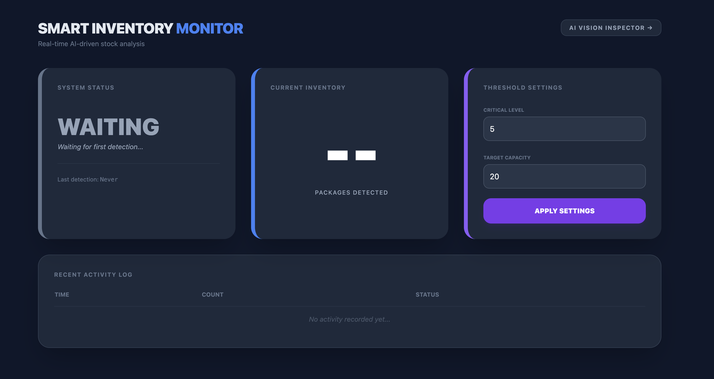

# 📦 Smart Inventory Monitor
### Real-time AI-driven stock analysis

**Smart Inventory Monitor** is a computer vision solution designed to automate stock counting in logistics environments. By leveraging a quantized **YOLOv8** model, the system tracks package counts in real-time, providing a reliable and automated alternative to manual inventory checks.

---

### 📡 Automated Data Flow
The system is architected to receive data directly from **IP cameras, Edge devices, or IoT sensors** via a REST API. This setup ensures the dashboard stays updated automatically as new images are processed by the server, eliminating the need for manual uploads and ensuring data is always synchronized with the physical warehouse.

---

## 🖥️ Dashboard Overview

The interface is structured into focused modules to provide immediate operational clarity:

* **System Status**: Tracks the real-time state of the monitoring task and connection.
* **Current Inventory**: Displays the live AI-processed count from the incoming sensor feed.
* **Threshold Settings**: A dedicated panel to calibrate **Critical Levels** and **Target Capacity** on the fly, triggering visual alerts when stock is low.
* **Recent Activity Log**: A timestamped audit trail that stores the **last 20 detection events**, allowing for quick historical verification and trend monitoring.

---

## 📺 System in Action

> **Sensor Simulation:** For this demonstration, a **Python-based sensor simulator** mimics an industrial IP camera by pushing images to the **AWS Fargate Task** at a constant 1 FPS rate. This showcases how the backend handles real-time inference and updates the global state without human intervention.

---

## 🔍 AI Vision Inspector (Audit Tool)
In addition to automated tracking, the system includes an **AI Vision Inspector** (accessible via the top-right button).

This tool acts as a quality control panel, allowing operators to manually upload specific frames to verify the model's accuracy and view the **Bounding Boxes** generated by the AI. It is essential for initial setup and periodic performance audits.

---

## 🧠 Engineering & Design Choices

### 🚀 Performance: ONNX on AWS Fargate
The model was converted from PyTorch to **ONNX INT8** to ensure high performance on cost-effective, limited hardware.
* **Efficiency**: Optimized for CPU-only inference on minimal **0.5 vCPU** instances.
* **Stability**: Keeps the memory footprint under **1GB RAM**, ensuring stable execution in serverless environments.

### 🌐 Networking: Dynamic DNS via DuckDNS
To avoid the fixed costs associated with an AWS Application Load Balancer, I implemented a custom **DuckDNS integration**.
* A startup hook in the FastAPI `lifespan` automatically updates the DNS record with the Fargate Task's public IP.
* **Result**: A reliable, reachable URL at zero infrastructure cost.

---

## 🛠️ Tech Stack
* **AI/ML**: Ultralytics YOLOv8, ONNX Runtime
* **Backend**: FastAPI (Python 3.11)
* **Infrastructure**: AWS ECS (Fargate), AWS ECR
* **Frontend**: Tailwind CSS, Vanilla JavaScript
