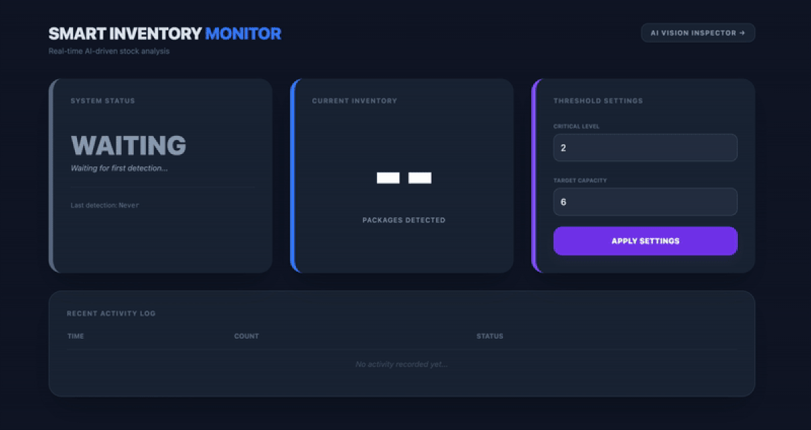
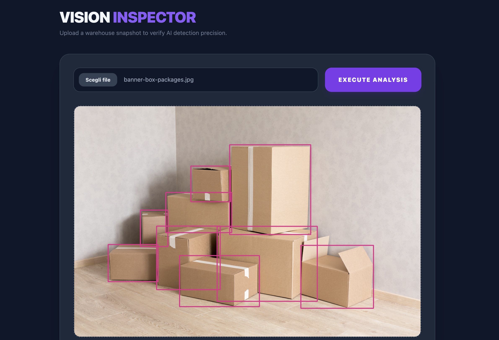

# 📦 Smart Inventory Monitor
### Real-time AI-driven stock analysis

> **Live Demo:** [inventory-monitor-denis.duckdns.org](http://inventory-monitor-denis.duckdns.org:8000/)  
> *(Note: This is an on-demand environment. If the link is unreachable, it is likely offline to optimize AWS infrastructure costs).*
>
> *Want to see the system react in real-time? You can simulate an industrial camera from your terminal by running our [Live Simulator](#try-it-yourself-live-simulator).*

**Smart Inventory Monitor** is a **Cloud-Native** computer vision solution designed to automate stock counting in logistics environments. By leveraging a quantized **YOLOv8 nano** model, the system tracks package counts in real-time, providing a reliable and automated alternative to manual inventory checks.

The system is specifically optimized for **monitoring stationary depots**. This focus on inventory state allows the architecture to remain lightweight and cost-effective, supporting a stable throughput of **2 FPS (Frames Per Second)**, a practical frequency that ensures accurate tracking for static stock while keeping cloud infrastructure overhead to a minimum.

---

### Automated Data Flow
The system is architected to receive data directly from **IP cameras, Edge devices, or IoT sensors** via a REST API. This setup ensures the dashboard stays updated automatically as new images are processed by the server, eliminating the need for manual uploads and ensuring data is always synchronized with the physical warehouse.

---

## Dashboard Overview


The interface is structured into focused modules to provide immediate operational clarity:

* **System Status**: Tracks the real-time state of the monitoring task and connection.
* **Current Inventory**: Displays the live AI-processed count from the incoming sensor feed.
* **Threshold Settings**: A dedicated panel to calibrate **Critical Levels** and **Target Capacity** on the fly, triggering visual alerts when stock is low.
* **Recent Activity Log**: A timestamped audit trail that stores the **last 20 detection events**, allowing for quick historical verification and trend monitoring.

---

## System in Action




> **Sensor Simulation:** For this demonstration, a **Python-based sensor simulator** mimics an industrial IP camera by pushing images to the **AWS Fargate Task**. This showcases how the backend handles real-time inference and updates the global state without human intervention.

---

## AI Vision Inspector (Audit Tool)
In addition to automated tracking, the system includes an **AI Vision Inspector** (accessible via the top-right button).



This tool acts as a quality control panel, allowing operators to manually upload specific frames to verify the model's accuracy and view the **Bounding Boxes** generated by the model.

---

## Engineering & Design Choices

### Model Evaluation & Dataset Scale
The project utilizes **YOLOv8n** (Nano), the most lightweight architecture in the YOLOv8 family. This choice was a strategic decision to enable high-speed inference on CPU-only environments. Given that inventory monitoring often involves static or slow-moving objects, the Nano model provides an ideal balance: it delivers the necessary precision for object counting while maintaining a memory footprint small enough for cost-effective serverless deployment.
> **Dataset Note**: The model was trained and validated on a large-scale custom dataset of **~10,000 images**. This high volume of data ensures the system is robust against varying lighting conditions and warehouse clutter.

| Metric | Value | Interpretation |
| :--- | :--- | :--- |
| **mAP50** | **0.828** | Solid detection and localization across thousands of test scenarios. |
| **mAP50-95** | **0.680** | Consistent bounding box accuracy, even with overlapping packages. |
| **Precision** | **0.877** | Extremely low false-alarm rate, essential for automated billing/audit. |
| **Recall** | **0.749** | Strong detection coverage in high-density storage environments. |

These metrics reflect the performance of the **ONNX INT8 quantized model**. 

### Infrastructure as Code (IaC): Terraform
The entire AWS environment is managed through **Terraform**, moving away from manual configuration toward a professional, reproducible setup.
* **Automated Provisioning**: Manages the lifecycle of AWS ECS (Fargate), ECR repositories, and all required IAM roles and security groups.
* **Operational Agility**: The entire infrastructure can be provisioned or destroyed in minutes with just a few commands, ensuring consistent environment replication and rapid testing cycles.
  
### Optimization & Efficiency
To ensure high performance on cost-effective, limited hardware, the model was converted from PyTorch to **ONNX INT8**. This optimization led to a system specifically tuned for **low-resource environments** (0.5 vCPU / 1GB RAM) on **AWS Fargate**:

* **-13.6% in Total Server Latency (End-to-End)**: Significant reduction in the full request-to-response cycle, ensuring a more responsive and stable monitoring heartbeat.
* **-71.7% in RAM Consumption**: Massive reduction in memory footprint, allowing the system to run comfortably on low-tier serverless instances with consistent performance.
* **-51.8% in Container Image Size**: Half the size of the original image, resulting in faster cold starts and lower storage overhead on AWS ECR.
  
### Networking: Dynamic DNS via DuckDNS
To avoid the fixed costs associated with an AWS Application Load Balancer, I implemented a custom **DuckDNS integration**.
* A startup hook in the FastAPI `lifespan` automatically updates the DNS record with the Fargate Task's public IP.
* **Result**: A reliable, reachable URL at zero infrastructure cost.
* **Production Scalability**: While this setup is optimized for cost-efficiency in a demo environment, a **production-grade deployment** would transition to an **AWS ALB** (Application Load Balancer). This would natively handle HTTPS/SSL termination and provide a **stable DNS entry point** (via Route 53), completely eliminating the need for dynamic IP updates and external workaround scripts.
  
---

## Tech Stack

* **AI & Machine Learning**: PyTorch, Ultralytics YOLOv8n, ONNX Runtime (INT8 Quantization)
* **Backend**: FastAPI (Python 3.11), Boto3 (AWS SDK)
* **Infrastructure as Code**: Terraform
* **Cloud Services (AWS)**: ECS Fargate (Serverless), ECR (Container Registry), IAM
* **Networking**: DuckDNS API (Dynamic DNS integration)
* **Frontend**: Tailwind CSS, Vanilla JavaScript (Modern ES6+)

---

## Future Roadmap

While the current iteration focuses on a lean, cost-effective MVP, the following enhancements are planned for a production-grade release:

* **Smart Alerting System**: Implementing **AWS SNS** (Simple Notification Service) or **AWS SES** to actively notify warehouse managers via email or SMS immediately when stock levels fall below the critical threshold.
* **Data Persistence**: Integrating **AWS DynamoDB** (NoSQL) to replace the in-memory activity log. This would enable long-term historical analysis, identifying stock trends and consumption patterns over months or years.
* **User Authentication**: Implementing **AWS Cognito** or OAuth2 to secure dashboard access and manage granular user roles (e.g., Admin vs. Viewer).
* **CI/CD Automation**: Setting up **GitHub Actions** workflows to automatically run tests, build the Docker image, and apply Terraform changes upon pushing to the main branch.

---

<a name="try-it-yourself-live-simulator"></a>
## Try it yourself: Live Simulator 

To demonstrate the system's ability to handle remote data ingestion, I developed a **Python client** that simulates an industrial IP camera. It performs local image optimization and pushes frames to the AWS endpoint.

### How to run the test:
1. **Navigate to the simulation folder**:
bash
```
cd simulation
```

2. Install dependencies
It is recommended to use a virtual environment. Install the required libraries using the provided requirements file:

bash
```
pip install -r requirements.txt
```

3. Run the simulator
Execute the script to start sending frames from the `sample_images` folder to the AWS endpoint:

bash
```
python simulate.py
```

4. Monitor the Results
Open the **[Live Dashboard](http://inventory-monitor-denis.duckdns.org:8000/)** in your browser. As the script sends each frame, you will see the dashboard that changes


